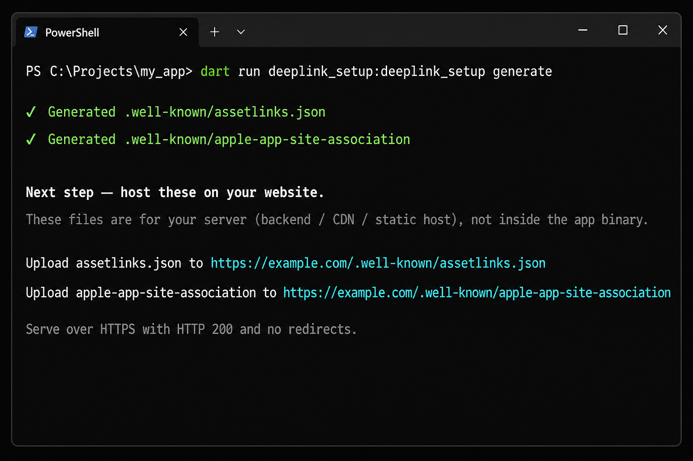
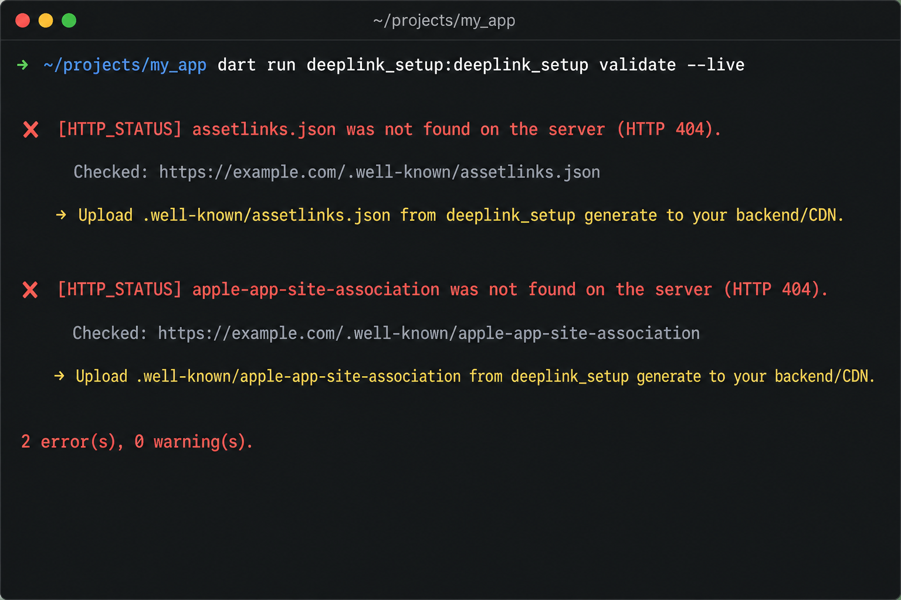
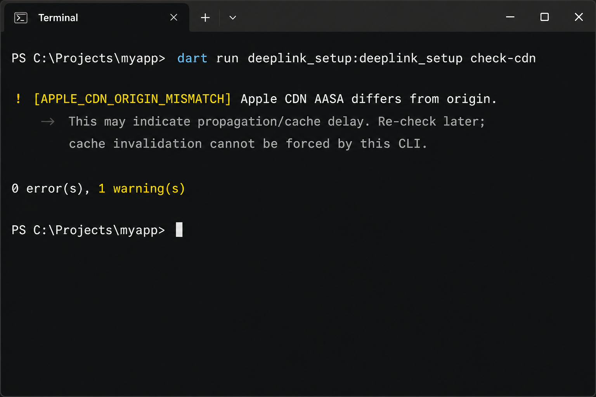

# deeplink_setup

Generate, validate, and diagnose **Android App Links** and **iOS Universal Links** from one Flutter CLI.

Deep links break when the app, the website files, and Apple’s AASA cache disagree. `deeplink_setup` writes the `.well-known` files, edits Android/iOS project settings safely, and checks the live URLs — including when Apple is still serving an old AASA (this tool cannot clear that cache).

<p align="center">
  
</p>

## Install

```yaml
dev_dependencies:
  deeplink_setup: ^0.1.0
```

```bash
dart pub get
dart run deeplink_setup:deeplink_setup --help
```

## Quick start

Run from the Flutter app root (the folder with `pubspec.yaml`):

```bash
dart run deeplink_setup:deeplink_setup init --domain your-domain.com
# Review deeplink_config.yaml (set ios.team_id and release SHA if needed)

dart run deeplink_setup:deeplink_setup generate
dart run deeplink_setup:deeplink_setup configure
dart run deeplink_setup:deeplink_setup validate --local
```

Upload these files to your **website** (backend, CDN, or static host) — not into the app binary:

```text
https://your-domain.com/.well-known/assetlinks.json
https://your-domain.com/.well-known/apple-app-site-association
```

They must be public HTTPS, HTTP **200**, and **no redirects**. Then:

```bash
dart run deeplink_setup:deeplink_setup validate --live
dart run deeplink_setup:deeplink_setup check-cdn
dart run deeplink_setup:deeplink_setup doctor
```

## Screenshots

**Live check shows the exact URL** when the file is missing on the server:



**Apple CDN still serving an old AASA** is a warning, not a cache-clear button:



## Commands

| Command | What it does |
| --- | --- |
| `init --domain example.com` | Scans the Flutter project and writes `deeplink_config.yaml`. Missing `keytool` or Team ID is a warning; the file is still created. |
| `generate` | Writes `.well-known/assetlinks.json` and `apple-app-site-association`. Host these on the website. |
| `configure` | Adds App Links on **MainActivity** and iOS Associated Domains. Backups: `*.deeplink_setup.bak`. |
| `validate --local` | YAML + local files must match `generate`. Exit `1` if missing or stale. |
| `validate --live` | Fetches the live origin (no redirects) and compares JSON to your config. |
| `check-cdn` | Origin AASA vs Apple’s CDN copy. Mismatch = warning; typical refresh a few hours–24h, rarely several days (TTL). |
| `test-live` | Live checks plus the URLs to open in a browser. |
| `doctor` | Local + live + CDN in one command. |

Exit codes: `0` ok (warnings allowed), `1` error, `64` bad usage.

## Config

`init` writes `deeplink_config.yaml`:

```yaml
domain: example.com

android:
  package: com.example.app
  sha256: "AA:BB:CC:..."

ios:
  bundle_id: com.example.app
  team_id: ABCDE12345

paths:
  - "/*"
```

| Field | Meaning |
| --- | --- |
| `domain` | Host that will serve `.well-known` (no `https://`). |
| `android.package` | Gradle `applicationId`. |
| `android.sha256` | Signing fingerprint. Debug may be detected; **Play/release SHA should be pasted**. |
| `ios.bundle_id` | iOS bundle ID. |
| `ios.team_id` | 10-character Apple Team ID (Xcode Signing, or Apple Developer → Membership). |
| `paths` | URL paths the app should open (`/*` = all). |

Android-only or iOS-only is valid. If `bundle_id` is set, `team_id` is required.

## Apple CDN

iOS often reads AASA from Apple’s CDN, not your origin. After you upload a new file, Apple typically re-crawls in a **few hours, often within 24 hours**. In rare cases it can take **several days** (TTL). `check-cdn` reports a mismatch as a warning and prints both URLs. **There is no API to flush Apple’s cache.** Re-run `check-cdn` later.

## CI

```bash
dart run deeplink_setup:deeplink_setup validate --local
dart run deeplink_setup:deeplink_setup validate --live
```

## License

MIT
